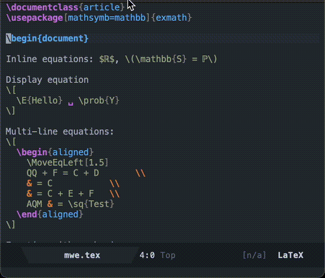

# preview-point

Emacs package for displaying context-sensitive preview frames at point. The
frame updates dynamically with buffer position and hides when the buffer is
deselected.



It relies on two helper packages that can be used separately as well:

### `preview-dvi`
Provides common interface with various improvement (to temporary file
creation/maintenance) for conversion of `dvi` previews to other formats like
`png` and `svgm`.

### `buframe`
Utility for creating and managing temporary frames tied to a buffer.

## Installation

Clone the repository and add to your `load-path`:

```elisp
(add-to-list 'load-path "/path/to/repo")
(require 'preview-point)
```

## Usage and configuration

The default configuration assumes that `dvisvgm` is installed.

```elisp
;; Minimum configuration to enable point-preview
(setq preview-image-type 'point-dvisvgm)

;; Configuration of preview for optimal behavior -- Optional
(setq
   buframe-update-debounce-delay 0  ;; No delay in buframe
   preview-leave-open-previews-visible t
   preview-auto-cache-preamble t
   preview-locating-previews-message nil
   preview-scale-function (lambda () (* (funcall
                                         (preview-scale-from-face))
                                        1.5)))

;; Always use DVI to generate cleaner previews. Requires special handling of `hyperref`
(setq preview-LaTeX-command-replacements '(preview-LaTeX-disable-pdfoutput))

;; Customize behavior of point-preview
(setq preview-point-progress-indicators 'faces
      preview-point-show-in 'buframe ;; or 'after-string for an inline preview intead.
      )

;; Enable automatic preview update on change.
(add-hook 'LaTeX-mode
          (lambda () (add-hook 'after-change-functions
                               #'preview-point-buf-change nil t)))
```
